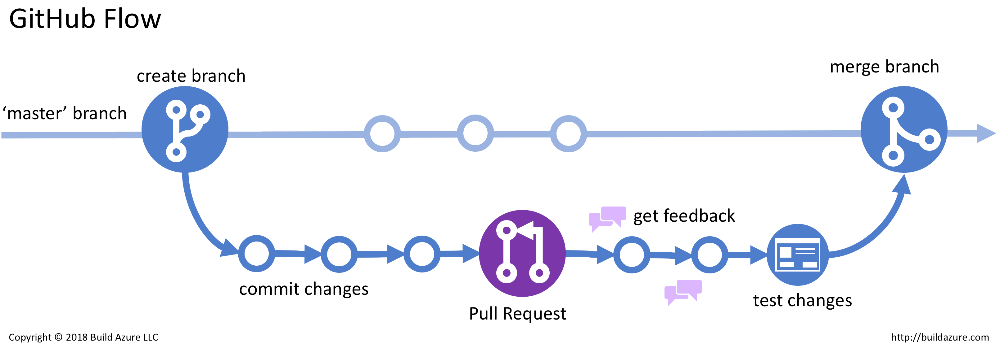

## Conceitos básicos envolvendo git

<center>
    
</center>

###  Repositório

De forma resumida, um *git repository* é um diretorio com a extensão **.git** dentro do seu projeto. Ele funciona rastreando as mudanças feitas nos arquivos do seu projeto, construindo dessa forma um histório deles ao longo do tempo.

Cada diretório possui uma pasta oculta chamada **.git**, sendo que nela são armazenado todas as informações necessárias para realizar o rastreamento dos arquivos.

O rastreio começa quando, dentro da pasta do seu projeto, no terminal você executa: 

```
    git init
````

### Commit

Um **commit** é como se fosse um checkpoint do seu projeto. Ele grava uma *snapshot* do seu projeto, mantendo todos os arquivos e o estado de cada um naquele momento do desenvolvimento. 

Ao realizar um commit é obrigatório anexar uma mensagem, normalmente ela carrega uma descrição das alterações realizadas.

Com ele é possível resgatar versões anteriores do projeto navegando pelos commits anteriores.

Alguns dos comandos úteis são:

Comita alterações em stage:
```
    git commit -m "message" 
````
Exibe o histórico de alterações:
```
    git log 
````

Uma boa prática utilizando commits é realizá-los a cada alteração importante dentro do projeto, construindo assim uma linha do tempo com alterações significativas. 

Uma timeline com várias modificações mínimas torna o trabalho de navegar entre os commits anteriores para reversão *(rollback)* e revisão de código *(code review)* um processo mais lento e custoso.

### Estados dos arquivos antes de um commit

- **Modified:** Arquivos que alterados que diferem do último estado que estavam em relação ao ultimo commit aparecem como modificados `modified`.

- **Staging:** Arquivos que estão prontos e que compõem o próximo commit são listado como preparados `staging`. 

    Você utiliza a área de preparação (ou palco) para indicar exatamente quais arquivos você quer incluir no próximo commit. Isso te dá um maior controle sobre o historico do projeto.

    #### Comandos úteis: 

    Adiciona um arquivo em particular ao stage:
    ```
        git add <arquivo> 
    ````

    Remove um arquivo em particular do stage:
    ```
        git rm --cached <arquivo>
    ````

    Remove adiciona todas as novas alterações ao stage:
    ```
        git add . 
    ````

    Exibe os arquivos que ainda não estão preparados:
    ```
        git status
    ````

- **Committed:** Arquivos que foram adicionados a área de stage (escolhidos a dedo) e foram comitados aparecem como `commited`.

### Branch

<center>
    
</center>

Dentro do ecosistema do *git*, uma branch aparece como um **espaço de trabalho separado** onde você pode fazer alterações e testar novas ideias sem impactar o fluxo principal do seu projeto. 

É fundamental para trabalhar em novas funcionalidades ou correções de bugs sem afetar o estado atual do projeto. Mantendo dessa forma sempre um *checkpoint* de uma versão concreta e estável ao alcance a partir de alguns comandos.

Algumas das principais boas práticas utilizando branchs são: 

- Se utilizar de nomes descritivos e claros no momento de nomear elas (ex: feature/login-page ou bugfix/header-crash).

- Manter cada ramo focado em um único propósito ou característica *(Short-lived Feature Branches)*. 

    Branchs extensas demais podem gerar um acoplamento entre as mudanças tornando difícil a reversão de apenas uma delas em caso de **falha crítica**, além de que torna a timeline do projeto mais confunsa com descrições genéricas e a revisão de código um trabalho mais desgastante,

#### Comandos úteis:

Cria uma nova branch paralela a branch principal `main`:
```
    git branch <nome-da-branch>
````

Apaga uma branch criada anteriormente:
```
    git branch -d <nome-da-branch>
````

Navega para outra branch do projeto:
```
    git checkout <nome-da-branch>
````

Lista as branchs e exibe em qual o usuário está situado:
```
    git branch
````

### Merge

Merge no contexto do *git* significa unir as mudanças de um ramo para o outro.

Para realizar um merge, o primeiro passo é navegar para a branch de destino (aquela que receberá as novas alterações), que geralmente é a `main`. 

Uma vez nela, utiliza-se o comando `git merge <nome-da-branch-secundaria>` para incorporar o histórico do ramo paralelo ao seu. É importante destacar que, após o merge, a branch secundária permanece ativa no seu repositório local. Caso não pretenda mais utilizá-la para novos commits, o ideal é removê-la manualmente para manter o projeto organizado.

#### Comandos úteis:

Mescla a branch secundária com a branch no qual o usuário se encontra:
```
    git merge <nome-da-branch>
````

Aborta uma tentativa de merge
```
    git merge --abort
````

!!! Conflitos de fusão

    Em determinadas ocasiões, ao realizar um merge entre duas branchs podem surgir *conflitos entre os ramos (merge conflicts)*. Por não ser algo isolado e que aparece com certa frequência é útil entender quando e porquê eles aparecem e como tratar as divergências entre arquivos. 

    Conflitos de fusão aparecem quando **dois ramos do projeto** modificam uma parte de um mesmo arquivo (linhas iguais), fazendo com que o git fique confusso sobre qual das versões ele deve manter. 

    Nesse caso, o merge automático do git falha e ele aguarda que você resolva os conflitos e indique quais trechos de código devem prevalecer em relação a outros. Isso é feito dentro da IDE. Surge então marcações como as da imagem:

    <center>
        
    </center> 

    Onde: 

    - <<<< : Indicam trechos de código conflitantes presente na branch em que o usuário se encontra. 

    - ==== : Representam trechos de código conflitantes presentes na branch que você está tentando fundir com a atual.

    - Accept Current Change: Dá prioridade para o trecho de código que existe dentro da sua branch. 

    - Accept Incoming Change: Dá prioridade para o trecho de código que existe na branch secundário que você está tentando combinar. 

    - Accept Both Changes: Elenca os dois trechos de código conflitante em um mesmo arquivo. 

