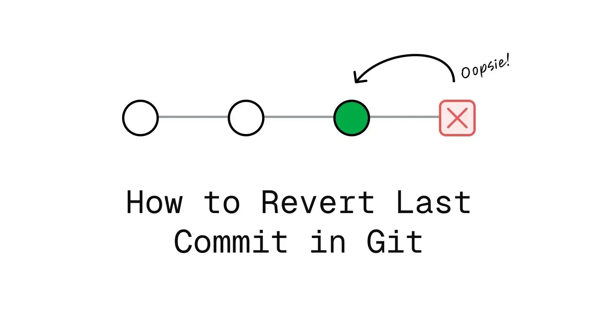

## Desfazendo commits

<center>
    
</center>
<BR>

É comum realizarmos commits acidentais na branch principal ou percebermos que mudanças recém-implementadas não se comportam como o esperado. Para esses cenários, é fundamental saber como tratar o estado do último commit. O Git oferece diferentes estratégias para reverter alterações, cada uma adequada a um contexto específico — seja preservando o histórico ou limpando o ambiente local. 

Este resumo detalha essas abordagens e apresenta os comandos essenciais para cada operação.

### Git Checkout 

O comando `git checkout` no contexto de desenvolvimento é utilizado principalmente com o intuito de fazer uma troca entre branchs ou restaurar arquivos da árvore de trabalho.

Abaixo são listados os principais recursos envolvendo ele: 

#### Comandos úteis

Altera para a branch especificada:
```
    git checkout <nome-branch>
```

Em geral, o *git* impede a alternância entre branches caso o seu diretório de trabalho não esteja "limpo" (clean). Essa é uma medida de segurança preventiva para evitar a perda de modificações não salvas ou conflitos acidentais durante a troca de contexto. 

Um diretório é considerado como "limpo" quando o estado atual dos arquivos locais coincide exatamente com aqueles do último commit.

Quando isso não é possível existem três caminhos possíveis para as alterações recentes: 

- Eliminá-las
- Fazer um commit em que elas estejam inclusas
- Colocá-las em stash

!!! Utilizando o stash

    O *git stash* é utilizado em momentos em que você precisa alterar de branch mas seu diretório ainda não está "limpo", ou seja, ainda existem alterações que não estão no repositório remoto as quais você quer manter.

    O comando `git stash` te permite salvar rapidamente alterações recentes ainda não comitadas em uma pilha interna (do próprio git). Dessa forma seu ambiente volta ao estado do último commit e o *git* te permite trocar de branch.  
    
    Ao voltar para a branch original você utiliza o comando `git stash pop` para trazer o conteúdo salvo na pilha de volta para o seu ambiente.

### Git Reset 

O comando `git reset` funciona movendo o seu HEAD para um commit diferente. A depender da opção, ele pode alterar mudanças que se encontram em `staging` ou até mesmo excluir alterações presentes no seu diretório de trabalho. 

Ao contrário de outros comandos de reversão, como o `git revert` é necessário atenção ao se utilizar do `git reset` pois **dependendo da *flag/argumento* utilizada ( --soft, --mixed ou --hard) as alterações realizadas impactam diretamente no histórico compartilhado do projeto, podendo dessa forma prejudicar outros desenvolvedores.** 

Outra característica pela qual ele não é recomendado ao se trabalhar com diretórios públicos é que o histórico depois do commit que o HEAD passa a apontar é apagado (git log).

#### Tipos de argumento: 

- `git reset --soft <commit>`: Essa é a forma mais segura de utilizar o comando. Com esse argumento o HEAD passa a apontar para um commit anterior especificado e todas as alterações de commits posteriores são colocados em `staging`.

- `git reset --mixed <commit>`: Essa é a forma padrão, o git assume que você selecionou ela se nenhum argumento for passado `git reset <commit>`. Assim como o anterior ele move o HEAD para algum lugar anterior, contudo as alterações dos commits posteriores são colocadas em `unstaged`, ou seja, os arquivos são listados como modificados.

- `git reset --hard <commit>`: Esse é com certeza o mais perigoso de todos com ele alterando a posição do HEAD e descartando todas as alterações dos commits posteriores.  

### Git Revert

Já o comando `git revert` desfaz um commit anterior (ctrl + z), que vamos chamar de A, criando um novo commit B que reverte as mudanças de A. 

A vantagem de utilizá-lo ao invés de simplesmente forçar a exclusão de um commit com `git reset --hard HEAD~1` é que você mantém seu histórico de commit intacto, **sendo a forma mais segura, e preferível para desfazer mudanças quando se trabalha em um repositório compartilhado.** 

#### Comandos úteis

Reverte o commit mais recente na branch:
```
    git revert HEAD
```

Reverte um commit em particular da branch:
```
    git revert <id-do-commit>
```
Mostrar o histórico de commits:
```
    git log --oneline
```

#### Exemplo de aplicação 

Suponha que você esteja trabalhando em um software de uma calculadora, mais especificamente na função responsável por realizar a divisão de dois números. Acidentalmente você apaga uma linha responsável por verificar se o valor do divisor é menor ou igual a zero quebrando assim o código. Nesse caso, você utiliza o `git revert`

Antes do código quebrar: 
```python
    def dividir(a, b):
        if b < 0 || b == 0: 
            print("O divisor não pode ser menor ou igual a zero")
        else: 
            return a / b
```

Depois do código quebrar: 
```python
    def dividir(a, b):
            print("O divisor não pode ser menor ou igual a zero")
        else: 
            return a / b
```

Suponha que o commit com o código quebrado possua a hash `e4f5g6h`. Assim o comando precisa referenciar esse identificador para reverter o código. 

```
    git revert e4f5g6h
```

Código depois do revert: 
```python
    def dividir(a, b):
        if b < 0 || b == 0: 
            print("O divisor não pode ser menor ou igual a zero")
        else: 
            return a / b
```

Note que a linha com a condição que foi apagada retornando ao seu estado original antes do commit com uma modificação equivocada `e4f5g6h` como se tivessemos pressionado `ctrl + z`. Além disso, outro efeito colateral é a criação de um novo commit na timeline que reverte as alterações daquele selecionado.  

```
a9b8c7d Revert "Remove validação do divisor"
e4f5g6h Remove validação do divisor
c3d2e1f Implementa validação para divisão por zero
b1a0f9e Cria função dividir
```