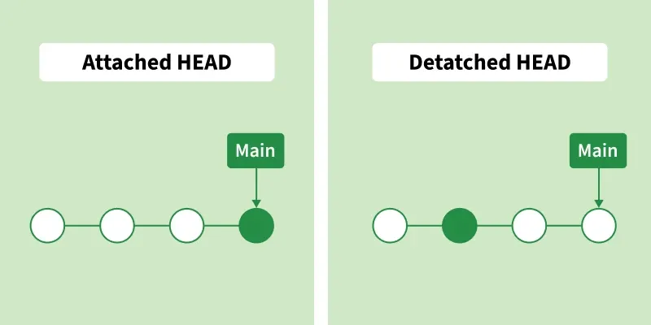

## Git HEAD

<center>
    
</center>
<BR>

### Attached HEAD

O HEAD dentro do *git* pode ser descrito como um "ponteiro" ou marcador de posição que existe em cada *branch* na qual o usuário decide navegar. 

Por padrão (attached HEAD), ele aponta sempre para o commit mais recente dentro da branch, mantendo esse comportamento inclusive quando um novo commit é adicionado ao ramo.

O HEAD acompanha o usuário toda vez que há uma troca entre os branchs ou uma verificação de um commit específico utilizando o `checkout`. Ele se move de acordo para apontar sempre para o último commit relevante.

---

### Detatched HEAD

Você entra neste estado ao usar `checkout` em um commit específico ao invés de uma branch como é de costume quando se deseja alterar de ramo. Nesse modo o HEAD aponta diretamente para um commit e não para uma referência de branch.

<center>
    
</center>


A vantagem de fazer isto é que você volta ao estado dos seus arquivos no momento daquele commit em particular. 

A desvantagem é que, ao fazer isto você passa a não trabalhar mais  na ponta de um galho, o que significa que quaisquers commits feitos nesse estado não estarão vinculados a nenhum ramo.

Você pode voltar ao estado de anexado (attached) usando o `checkout <branch-name>` entretanto os commits realizados em detatched não serão mantidos a menos que sejam previamente salvo em uma nova branch.

Para salvar essas alterações avulsas você utiliza: 
```
git checkout -b new-branch-nam
```

Ao usar ele você cria um novo ramo a partir da sua posição atual do HEAD e muda para ele. 