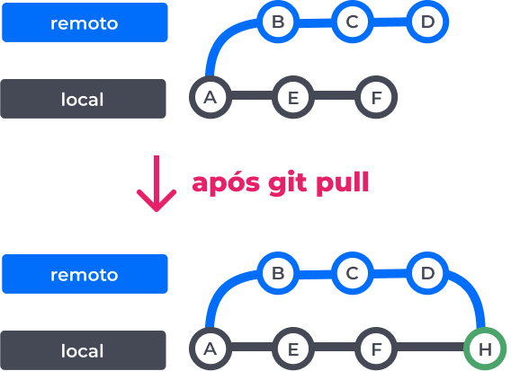
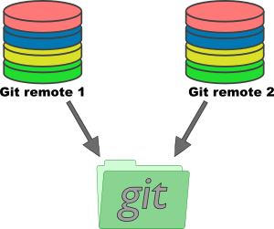

## Sincronização entre repositório local-remoto 

<center>
    
</center>
<BR>

### Git pull

O `git pull` é o comando utilizado para sincronizar o repositório local em relação ao remoto. Ele funciona baixando o conteúdo alterado ou novo que existe no servidor e atualizando o repositório local com esse mesmo.  

Quando utilizamos o `git pull`, o que estamos fazendo na realidade é executar dois comando em sequência, sendo eles `git fetch` (que baixa os dados e metadados do servidor sem mesclagem) e `git merge` (que funde as alterações que existem remotamente com o conteúdo do repositório local para essa branch). Ao final um novo commit será criado e o HEAD apontará para ele.

O `git pull` permite que você trabalhe sempre com a versão mais **atualizada do código**. Isso é fundamental em fluxos de trabalho colaborativos, pois evita transtornos comuns ao integrar branches diferentes, tais como: 

* **Risco de sobrescrita:** Tentar forçar alterações de uma branch antiga como definitivas em uma estrutura que já mudou completamente no servidor. Nesses casos, o risco de apagar um código importante é **alto**.

* **Merge hell:** Ao integrar mudanças de um ramo desatualizado com uma branch atual, muitas vezes é necessário analisar ambos detalhadamente para garantir que um não quebre o outro, gerando um processo complexo e lento.

* **Validação funcional:** Ao puxar o código do servidor, você certifica-se de que as atualizações de terceiros não quebraram suas funcionalidades locais, ganhando "espaço" e tempo para trabalhar em eventuais correções.

#### Comandos úteis

Baixa os novos commits daquela branch específica e os mescla na sua branch atual:
```
git pull origin <branch>
```

Baixa (através de um `fetch`) as informações e metadados de todas as branchs relacionados aos *remotes* configurados, entretanto o merge só acontece na branch e *remote* atual:
```
git pull --all
```

Força um sincronização entre o ambiente remoto e local mesmo que isso signifique perder seu trabalho que não subiu para o servidor:
```
git pull --force
```

Permite uma sincronização entre as branchs locais e remotas, apagando todas aquelas que só existem na máquina do usuário:
```
git pull origin <branch> -p
```

!!! Remotes: 

    Remotes são instâncias do seu projeto hospedadas em servidores externos, como o GitHub. Eles funcionam como uma cópia centralizada que permite salvar seu trabalho na nuvem, manter o código sincronizado entre diferentes máquinas e facilitar a colaboração entre membros de uma equipe.

    No Git, um repositório remoto é gerenciado através da associação de uma URL (o endereço do servidor) a um apelido curto, o que simplifica a execução de comandos no terminal. Por convenção, o primeiro remoto configurado em um projeto recebe o nome de origin. 

    Usando o comando `remote add` você pode adicionar um URL remoto a um nome, sendo que sua sintaxe se assemelha a: 

    ```
    git remote add <name> <remote-URL>
    ```

    <center>
        
    </center><BR>
   

### Git pull rebase